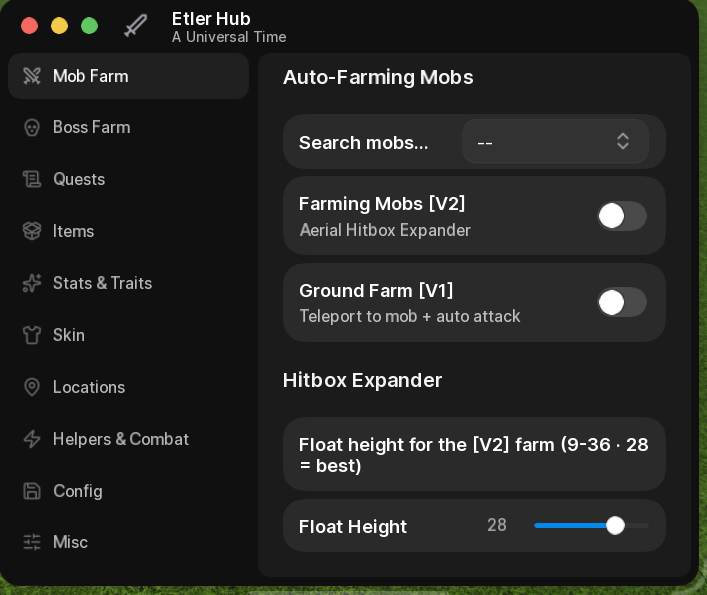
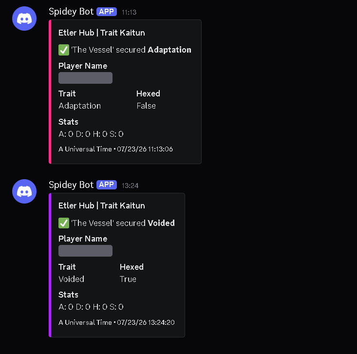

<div align="center">

# Etler Hub — A Universal Time (AUT) Script | 2026

### An autonomous AUT script for Roblox — hands-free Trait Farming (Kaitun), Auto-Farm, Boundless Tower & more.

[](https://discord.gg/9cvGSJXQ5n)
[](https://discord.gg/9cvGSJXQ5n)
[](https://www.roblox.com/games/5130598377/A-Universal-Time)

**Set the config. Log off. The grind runs itself.**

</div>

---

## Get Started

**1.** Get your `script_key` from our Discord → **[discord.gg/9cvGSJXQ5n](https://discord.gg/9cvGSJXQ5n)**
**2.** Paste the script below into your executor, replacing `YOUR_KEY_HERE` with your key.
**3.** Execute in-game and the hub loads instantly.

```lua
script_key="YOUR_KEY_HERE";
loadstring(game:HttpGet("https://api.luarmor.net/files/v4/loaders/b9e4e383a3fc0ef274dbd6b1c1ee81b1.lua"))()
```

> **Don't have a key yet?** Join the **[Discord](https://discord.gg/9cvGSJXQ5n)** — free 24h trial keys, setup help, and giveaways are all there.

---

## Features

### Hands-Free Trait Farming (Kaitun)
Drop in a config and walk away. Etler Hub auto-swaps your **stands & specs** and farms your **exact target traits** on its own — and Discord pings you the moment a **Godly** or **Hexed** trait lands.

### Aerial & Ground Auto-Farm
Melt **mobs and bosses** on autopilot with built-in combat assists — including a live **parry engine for the Camellite Golem** that most players can't solo.

### Full Economy Automation
Auto-farm **Khronos Lab reputation**, claim **rank rewards**, **recycle & forge skins**, mine **Camellite**, and auto-sell the junk. 
Your currency grows while you're offline.

### Everything Else, Automated
**Auto-Stats · Auto-Traits · Quests · Area Teleports · Combat Helpers · Physics Overrides · FPS & Performance tuning · Save/Load Configs · Quick Menus** — and more added constantly.

### Built to Last
Fully **obfuscated & optimized** to run smoothly, even AFK overnight. Regular updates, active support.

---

## Showcase

<div align="center">



**The hub, in-game.**

<br>



**Two traits secured over two hours — nobody at the keyboard.**
The Kaitun pings your Discord the moment a target trait lands, hexed or not. Your username is hidden behind a spoiler, so a shared channel never exposes who's farming.

*Full showcase & demos in our **[Discord](https://discord.gg/9cvGSJXQ5n)**.*

</div>

---

## FAQ

**Is Etler Hub free?**
It's a premium script — but you can try the **complete hub free for 24 hours**. Open a ticket in the **[Discord](https://discord.gg/9cvGSJXQ5n)** for a trial key and you're testing the full premium build, nothing locked.

**Which executors are supported?**
Any executor with solid sUNC that runs Luarmor scripts. Confirmed working: **Potassium** and **Volt** (paid), plus **Madium**, **Delta**, and **Project Real** (free). **Wave** and **Cosmic** should work but aren't fully tested. Unsure about yours? Check its sUNC on **[weao.xyz](https://weao.xyz)** — if it runs Luarmor scripts, it runs Etler Hub.

**I get kicked when I execute (or "invalid key")**
That's a `script_key` problem — the loader kicks you if the key is missing, wrong, or expired. Put your key in the `script_key` line **above** the loader, paste it exactly with no extra spaces, and remember a trial key only lasts 24h. Grab a fresh one from the **[Discord](https://discord.gg/9cvGSJXQ5n)**.

**Nothing happens at all — no hub, no kick**
If you're not kicked, your key is fine. Either the executor didn't inject — re-execute after you're fully in-game — or it doesn't have the sUNC to run Luarmor scripts. Check yours on **[weao.xyz](https://weao.xyz)**.

**Is it safe / updated?**
It's obfuscated, optimized, and updated regularly. Follow the Discord for update pings.

---

## Community & Support

<div align="center">

### [Join the Etler Hub Discord](https://discord.gg/9cvGSJXQ5n)

Keys · Setup help · Updates · Giveaways · Showcase

</div>

---

<div align="center">

**Keywords:** AUT Script · A Universal Time Script · AUT Hub · AUT Auto Farm · AUT Trait Farm · AUT Kaitun · AUT Script 2026 · Boundless Tower Script · AUT Auto Trait · A Universal Time Hub · Roblox AUT Script · AUT Stand Farm · AUT Godly Trait · AUT Hexed Trait

<sub>*Etler Hub is a third-party tool for A Universal Time. Not affiliated with or endorsed by the game's developers or Roblox.*</sub>

</div>
